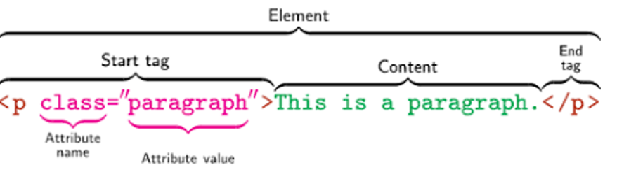

# MHC Web Dev Workshop

_Hello! Welcome to the PowerAdvocate web development workshop. Today we will be building a website that displays city-specific weather information from the OpenWeather API. This workshop aims to provide an overview of HTML (Part 1), CSS (Part 2), and JavaScript (Part 3), the foundations of web development._


## **Part 1: HTML - Content/Structure**

- To start off our web page we will need to build up the general structure of the page. In this part we will achieve that goal using HTML.

#### 1a) The first step to building this website is to make a header for the page. You can do that by opening the `index.html` file and adding an `h1` tag inside the `body` tag at the top. Within this tag you can put whatever you want to title the page, for instance: 'Weather App - Home Page'

- To learn more about the `h` tags see the documentation here: [W3 Schools](https://www.w3schools.com/tags/tag_hn.asp)

#### 1b) Currently you can see a list of each of the cities that we will be retrieving the weather for. However, lists are not the only way of displaying data, and sometimes we will want to use a dropdown to conserve space. To add a dropdown in HTML we will be using the `select` tag. Like the list we will also be using tags within the `select` tag to define the options. These options are created with the `option` tag. You shold use the same cities from your unordered list.

- To learn more about HTML dropdowns, see the documentation here: [W3 Schools](https://www.w3schools.com/tags/tag_select.asp)

#### 1c) Now we want to also include the ability to choose what kind of units we are measuring our temperatures with. Create a second dropdown next to the first that will have "Fahrenheit" and "Celsius" as its options. If you would like you can also add in "Kelvin".

#### 1d) Finally let's add in a button to get the weather once the user selects their city and units. To add in the button, we will use a `button` tag. To set the text of the button you will then simply write it between the opening and closing tags.

- To learn more about HTML buttons, see the documentation here: [W3 Schools](https://www.w3schools.com/tags/tag_button.asp)

## **Part 2: CSS - Styling**

- Now that the structure of the webpage has been defined through HTML, the style can be improved with CSS.
- There are a few key HTML/CSS concepts that will be applicable to the tasks in this section.

  - The behavior and style of HTML _elements_ (i.e. HTML tags and the information within those tags) can be modified through _attributes_.
  - A variety of attribute types can be applied to an HTML element; the most common attributes used to apply CSS are _classes_ and _IDs_.
  - The _class_ attribute is used as an identifier for HTML elements; CSS styling and JavaScript functionality can be applied to elements labeled with a given class. Multiple elements can have the same class attribute.
    - For example, if all of the headers on a page should have the same font, this can be achieved through a class attribute.
  - The purpose of an _ID_ is to distinguish **one** HTML element from others in regard to style or functionality. An ID attribute cannot be applied to multiple elements on a page.
    - For example, one header on a webpage should be a different color from other headers on the same page, so it has a unique ID attribute.
  - In a CSS file, class selectors are indicated by a `.` followed by the class name (e.g. `.weather-navbar`).
  - In contrast, ID selectors are represented by `#` followed by the name (e.g. `#boston`).
  - This image further demonstrates the combination of HTML and CSS with the aforementioned terms. 
  - For more information, check out a general CSS resource [here](https://www.w3schools.com/cssref/) and selector-specific
    information [here](https://www.w3schools.com/cssref/css_selectors.asp).

##### NOTE: Now that we've established the purpose of CSS class/ID selectors, feel free to jump to *Part 3* to add functionality to the webpage through JavaScript. Otherwise, this section will focus entirely on style changes through CSS.

#### 2a) Add ID attributes to "New York" and "Los Angeles" in the list (Boston already has one as an example). In `index.css`, change the text color of each city (color of your choice) using the corresponding ID selector.

 - [Reference to a list of css colors (you can use rgb or hex values as well!)](https://www.w3schools.com/cssref/css_colors.asp)

#### 2b) The layout of the elements on the page can be modified through CSS as well.

- Currently, the `div` with the class attribute `cities-2` is located under the one called `cities-1`; the goal is to align the two elements horizontally.
- As a first step, add `flex` as the display attribute in `index.css` for the `cities` class.
- Adding `flex` aligns the two elements, but they should not be taking up the same amount of space.
  Now that the elements are aligned in a `flex` "container", define (numerical) flex attributes for `#cities-1` and `#cities-2`
  so that `cities-2` takes up twice as much space as `cities-1` on the page (see example here: https://developer.mozilla.org/en-US/docs/Web/CSS/flex)

#### 2c) Now, it would take a long time to add all the styling we wanted through manual CSS. Thus, the basic style of the navigation bar will be set by [Bootstrap](https://getbootstrap.com/)! Bootstrap is a CSS framework that provides style "templates".

- There is currently a link to Bootstrap in `index.html`; this allows us to use features of the framework for the webpage.
- Add the Bootstrap `navbar` and `navbar-default` CSS classes to the `nav` tag. There should now be a visible bar at the top
  of the webpage.
- The element within the navigation bar (`Home`) can be styled with Bootstrap as well. To do so, add the `navbar-brand` class.
- Now that we've added the base styling for the navigation bar, we can finish up with some custom CSS.
- Looking at `index.css`, there is an empty CSS rule with the selector name `weather-navbar`. Add a `background-color` and `border-color`
  of your choice as properties.
- Further reference: https://getbootstrap.com/docs/4.0/components/navbar/#nav

#### 2d) **Bonus**: Feel free to add additional custom CSS styling based on the references provided above.

## **Part 3: JavaScript - Functionality**

- JavaScript allows us to add interactive functionality to our webpage! In this part, we will add functionality to the list so that when you click on a city, the current temperature in the city will be displayed in the selected unit (Farenheit, Celsius, Kelvin) in a weather blurb.
- To do this, we need to...
  - Get the required user input from our html page (selected city + temperature unit)
  - Make a http request to an API to retrieve weather data for that city 
  - Use the weather data we receive in that response to display a weather description "blurb"

#### 3a) Get data from our HTML page into JavaScript

- First, add an `onclick` attribute to your button element so that it looks like this:

  ```
  <button onclick="getWeather()">Get weather data</button>
  ```

- Next, in the `index.js` JavaScript file, we need to add to the `getWeather()` function in order to make the http request for the weather data and fill it in on our page.
- **Learn More**:
  - [What is an HTTP request?](https://developer.mozilla.org/en-US/docs/Web/HTTP/Overview)
- To do this, we have to first get the string from the city dropdown representing the city name and get the correct temperature unit from the unit dropdown.
  - **Hint**: Give the element an ID and use the `document.getElementById()` function (see documentation [here](https://developer.mozilla.org/en-US/docs/Web/API/Document/getElementById))
  - **Note**: You can declare variables in JavaScript using [let](https://developer.mozilla.org/en-US/docs/Web/JavaScript/Reference/Statements/let) or [const](https://developer.mozilla.org/en-US/docs/Web/JavaScript/Reference/Statements/const)
  - After we have the element, we just need to get its value (`.value`)
    - If you're unfamilar with JSON, give [this article](https://developer.mozilla.org/en-US/docs/Learn/JavaScript/Objects/JSON) a quick look

#### 3b) Make an http request to get weather data

- Once we have the city name and the temperature unit we would like to query the API with, we need to generate the correct url to send our http request to.
- The API endpoint we need to use to get the temperature data we want to display is `https://api.openweathermap.org/data/2.5/weather`

  - See its documentation in the OpenWeather API [here](https://openweathermap.org/current)

- **Learn More**:

  - [What is a REST API?](https://www.redhat.com/en/topics/api/what-is-a-rest-api)

- This endpoint needs a few pieces of data to be sent over in order to return a weather object ...
  - `q`: The city name of the city we wish to retrieve weather data for.
  - `units`: The desired unit of temperature to be returned...
    - `'standard'` is Kelvin
    - `'metric'` is Celsius
    - `'imperial'` is Fahrenheit
  - `appid`: The API key that we are using for this open weather API. For the purposes of this workshop, a valid API key has been provided for you in `index.js`
- An example url for this request for Boston's weather using metric units would look like this:
  ```
  https://api.openweathermap.org/data/2.5/weather?q=Boston&units=metric&appid=0fcc8d82213d6e2a6f0ee3fbf7ee556d
  ```
- Once we are able to construct a url from our city name, unit type, and API key, we can make the http request using the [fetch function](https://developer.mozilla.org/en-US/docs/Web/API/Fetch_API/Using_Fetch) to get the response (the JSON object it returns)

  ```
  const response = await fetch(url);
  ```

- **Note:** you will need to use the `await` keyword here. Sending HTTP requests over the internet takes an undeterministic amount of time. Commonly in JavaScript code, we will need to wait to receive the response to our HTTP request before continuing execution of our code. For the purposes of this workshop, always add await to your `fetch()` calls, so that you know that the response has been received before executing any more code. No need to worry about the details of async/await or Promises for this project, but if you are curious about asynchronous JavaScript code, here are some links to get you started:
  - [Using Promises](https://developer.mozilla.org/en-US/docs/Web/JavaScript/Guide/Using_promises)
  - [Promise Documentation](https://developer.mozilla.org/en-US/docs/Web/JavaScript/Reference/Global_Objects/Promise)

#### 3c) Get the temperature and fill in the html with the correct value

- Once you have made the http request, you can use the following code to retrieve the "feels like" temperature from the JSON object that the OpenWeather API endpoint responds with.
- Here is an example of how you can get the "feels like" temperature once you have made the request
  ```
  const response = await fetch(url); // url is your generated url with the city name, units, and API key filled in
  const weatherData = await response.json(); // extract JSON from the http response
  const feelsLikeTemp = weatherData.main.feels_like; // traverse the JSON to retrieve the "feels like" value in celsius
  ```

- When you have the "feels like" temperature, create a blurb to put on your website.

  - For example: "It's currently 50 °F in Boston."
  - You will need to update the `innerHTML` of the `weather-blurb` element on your page to be assigned to our new weather blurb string.

    ```
    document.getElementById('weather-blurb').innerHTML = blurb;
    ```

  - **Bonus:** if you'd like, add some logic to your JavaScript function to generate a blurb with conditional statements based on the temperature or other weather data that is returned by the endpoint.
    - For example, if it's < 40 °F, add "grab a jacket!" to the end of the message.

#### 3d) Get a weather icon to display on the page!

- Now that you have finished parts 3a, b, and c, let's try adding another feature to our page - **Add a feature to the page so that when you click on a city and display the weather blurb (from part 3c), a weather icon is displayed representing the type of weather (i.e. raining, partly cloudy, sunny, etc.)**
  - OpenWeather has an API endpoint that returns a weather icon based on a weather code
    - [Documentation](https://openweathermap.org/weather-conditions)
    - The API endpoint we used in step 3b returns an icon code you can use with the weather icon endpoint
  - You will need to use an `img` tag ([W3 Schools](https://www.w3schools.com/tags/tag_img.asp)) in order to display the icon on the page once you generate the correct url for the icon you need from OpenWeather's API.

## **Part 4: Second Page**

- Now that we have built up our first page, we are going to start building a second page for our weather website. One useful thing to see when trying to get the weather is to view it on a map, so we are going to add a map page into our site. 
- To start off, we will be linking to this new page from our original page. To do this we will add an additional link into the nav bar at the top of the screen and call it "Maps". This link will link to the `weather-maps.html` page. 
- You can use the existing link on the nav bar as a reference for creating the link to the maps page. Because the index html file and the maps html file are in the same folder, you only need to put the file name in the href field.
- Now that we have connected this second page to the first, lets add a header to the top of the page like we did for the first one. Choose an appropriate name for your new page!
- To save room for our maps, we are going to use a dropdown to select which city we want to zoom in on. This dropdown should include the three cities that were used on our first page.
- Now let's add in the maps. To start off, we are going to use an `iframe` tag to link the weather maps. `iframe` tags allow you to embed in other sites onto your page. To do this you will need to add in a src field. For our site we will be using this url in the `iframe`: https://openweathermap.org/weathermap?basemap=map&cities=true&layer=temperature&lat=42&lon=-71&zoom=7
  - To learn more about `iframe`s, see the documentation here: [W3 Schools](https://www.w3schools.com/tags/tag_iframe.asp)
- For the final step, add in the functionality so that when the user selects a city within the dropdown on the maps page, the map updates to center the map around that city. Within the `iframe` you can update it by changing the url field. To change the position of the map, update the lat and lon (latitude and longitude) values on the URL to be the city's latitude and longitude. Each city's coordinates are below:
  - Boston
    - Latitude: `42.3601`
    - Longitude: `-71.0589`
  - New York
    - Latitude: `40.7128`
    - Longitude: `-74.006`
  - Los Angeles
    - Latitude: `34.0522`
    - Longitude: `-118.2437`

<br/>

_Congratulations! You've completed the steps of the workshop and created a functioning website. Feel free to expand the site with any of the topics discussed today._
